# Hardened Self-Hosted Zero-Trust Web Server & Master's Thesis Platform

> **Project Overview:** A production-hardened, self-hosted web server deployment built on Debian to securely host a LimeSurvey instance for Master's thesis research. Designed around a Zero Trust architecture, the environment masks origin IPs via Cloudflare Tunnels, enforces custom WAF threat mitigation, restricts administrative access, and maintains an automated database backup pipeline.

## Overview
For this project I took an old machine that would otherwise be collecting dust and turned it into a public-facing web server, without opening up my home network in the process. Instead of the usual approach, forwarding ports 80 and 443 on the router, I built the whole thing around a Zero Trust tunnel, so the server can be reached from anywhere on the internet while the router itself stays completely closed to inbound traffic.

The primary motivation behind this setup stems from my Master's thesis research on AI-driven cybercrime, specifically evaluating human detection capabilities when identifying synthetic media. Existing commercial survey platforms proved too restrictive for embedding and hosting the large, high-resolution media files required for empirical testing. To overcome this, I deployed a self-hosted LimeSurvey instance and personally configured it to support custom upload parameters. However, exposing a self-hosted application handling research data required a security-first approach, prompting me to design and execute this end-to-end server hardening project to ensure the host and my home network remained fully secured against public threats.

---

## Setting Up the Server

### A Lean, Headless Base
The server runs a headless build of Debian, no desktop environment, no GUI packages, nothing that isn't needed to serve traffic. Cutting that out does two things: it shrinks the attack surface (fewer packages means fewer things that could have a vulnerability), and it keeps resource usage low, which matters on hardware this old.

For remote administration I set up SSH, but restricted it to the local network only. The management interface never touches the public internet, so even if someone found the domain, there's no way to reach an SSH login through it.

### Skipping Port Forwarding on Purpose
Most home-hosted sites rely on port forwarding, opening 80/443 on the router so traffic can reach the internal server. I deliberately avoided that, for two reasons:
* My home's public IP stays hidden. There's no direct line from the internet to my router's address.
* With no ports open, the automated scans that constantly probe residential IP ranges have nothing to latch onto. There's no entry point to find.

### Cloudflare Tunnel
To actually connect the local server to a public domain, I used a Cloudflare Tunnel via `cloudflared`. The tunnel daemon on the server opens an outbound-only connection to Cloudflare's edge network. Traffic to the site flows in through that tunnel, so there's never a need to open an inbound port on the firewall at all.

Everything moving between the server and Cloudflare's network is encrypted, which closes off the man-in-the-middle risk that a plain outbound connection would otherwise carry.

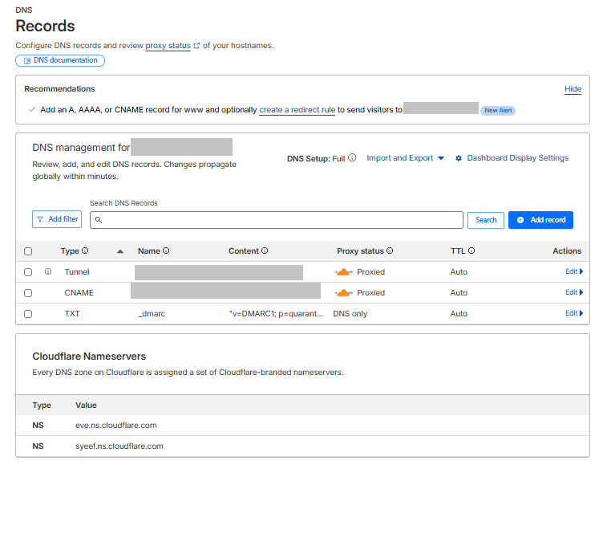

---

## Security Design Choices

### Offloading TLS to the Edge
Cloudflare handles the TLS handshake and certificate management, so the legacy hardware isn't spending its limited CPU on encryption overhead. That work happens at Cloudflare's edge instead. The one hop between the tunnel and Nginx does run over plain HTTP, but it never leaves the machine; it stays inside localhost, so nothing unencrypted ever actually crosses a wire or a wireless signal.

### Identity-Aware Access
Routing everything through a Zero Trust provider also opens the door to identity-based access control. I have the option to require an Access Policy, for example a specific email or a GitHub login, before anyone can even load the landing page, on top of whatever authentication the application itself handles.

### HTTP Response Hardening
A few more measures on top of the tunnel and TLS setup:
* Forced HTTPS with HSTS enabled, so the browser won't downgrade to plain HTTP and can't be tricked into SSL stripping.
* A no-sniff header (`X-Content-Type-Options`) to stop browsers from guessing content types, which cuts off a common vector for disguised-file attacks.
* Cloudflare WAF rules covering geofencing plus custom filters for SQL injection and XSS attempts.
* Nginx and MariaDB both locked down with least-privilege permissions and SSL enforced end to end.

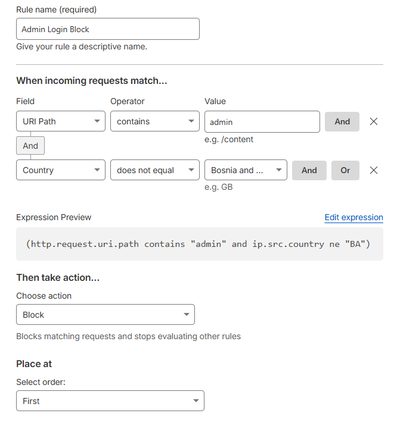

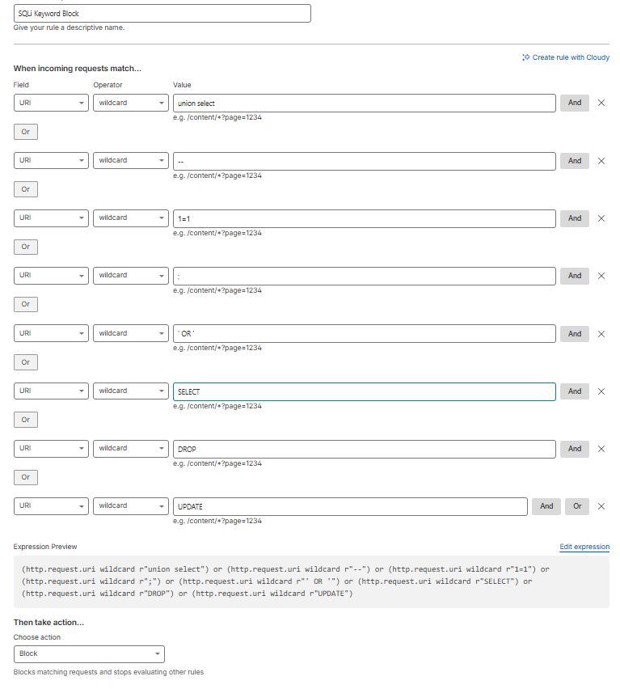

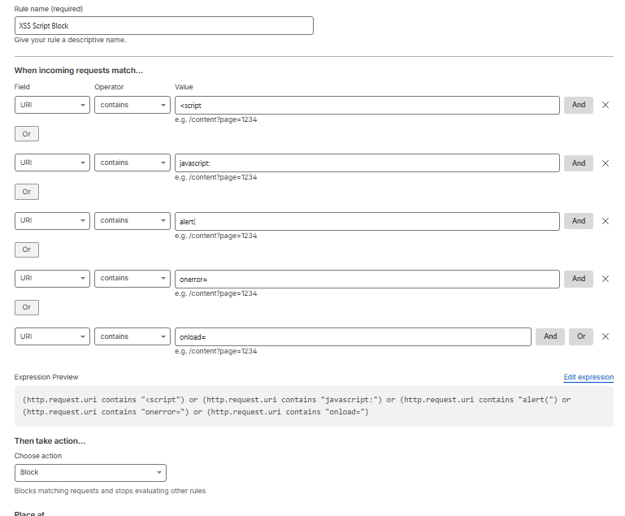

---

## Backups for LimeSurvey
The server also hosts a LimeSurvey instance, and I set up an automated backup routine for it using cron. This is really more of a reliability engineering task than a dev one. The job runs on a schedule, saves fresh backups, and prunes anything past a defined retention window so storage doesn't just fill up over time. Target recovery point is 24 hours, meaning at worst I'd lose a day of data if something went wrong.

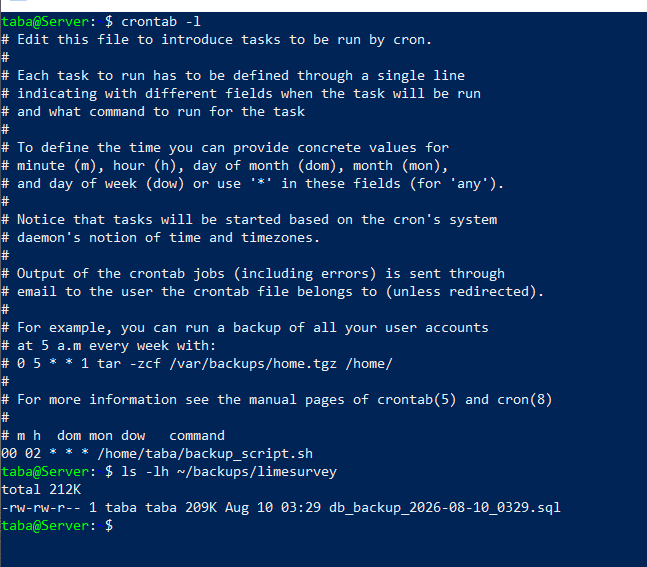

---

## SSH and Firewall Hardening

On the server itself, SSH access was moved off default port 22 to a non-standard port (**2345**), password authentication was disabled entirely, and key-based authentication was enforced. 

UFW is configured with a default-deny inbound policy, exposing only custom SSH port **2345** for local network administration. Standard web ports 80 and 443 remain completely closed at the firewall level since public traffic is handled via the outbound Cloudflare tunnel.

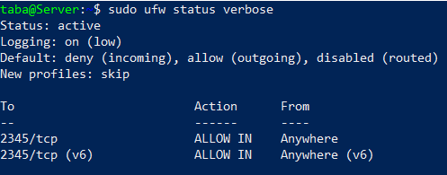
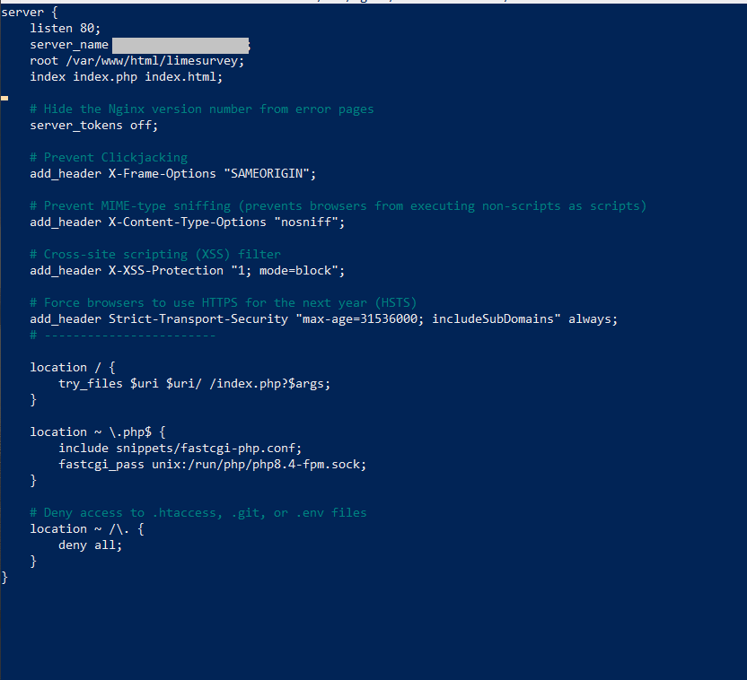

---

## Verifying the Setup
A quick look at the live response headers confirms the configuration is actually doing what it's supposed to:

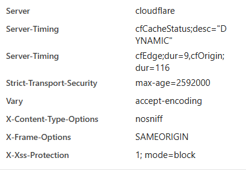

* **Server obfuscation**: the response just says “cloudflare,” with `server_tokens off` hiding the Nginx version and underlying OS from anyone probing for version-specific exploits.
* **MIME-sniffing protection (`X-Content-Type-Options: nosniff`)**: stops the browser from guessing content types, which closes off drive-by-download attacks that disguise a script as an image.
* **Clickjacking defense (`X-Frame-Options: SAMEORIGIN`)**: the site can't be framed on another domain, which rules out UI-redressing tricks.
* **HSTS**: tells the browser never to fall back to plain HTTP for the configured duration, closing off MITM downgrade attempts.
* **XSS protection header**: an extra layer that tells the browser to stop rendering the page if it detects an injected script.

The origin server is hardened on its own, but final header delivery happens at Cloudflare's edge, so HSTS and the server-header obfuscation are enforced there too, which takes load off the origin and is faster for the end user besides.

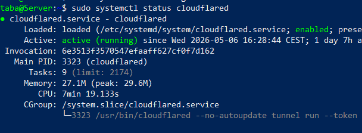
*Cloudflare Tunnel status: outbound-only connection to the Cloudflare edge*

The log above shows a persistent, encrypted tunnel session to Cloudflare. Because the connection is outbound-only, I was able to close ports 80 and 443 on the local firewall entirely. The origin server isn't discoverable by direct IP scanning at all.

---

## Penetration Testing
To actually verify the “origin shielding” claim rather than just take it on faith, I ran a two-part Nmap test from a Kali Linux box, targeting the setup from an outside attacker's perspective.

### Audit 1: Scanning the Public Domain
First, a standard service discovery scan against my website, to see what a real visitor (or attacker) would find.

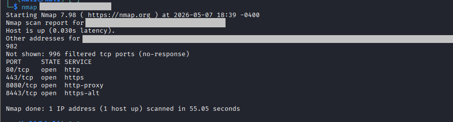

The domain resolves to one of Cloudflare's Anycast addresses, not my home IP, and the open ports (80, 443, 8080, 8443) all belong to Cloudflare's edge nodes. They're the ones handling SSL termination and filtering before anything reaches my infrastructure. In other words, an attacker scanning the domain only ever sees Cloudflare's hardened network, never the actual origin.

### Audit 2: Checking the Origin IP Directly
Second, after pulling my home public IP with `curl ifconfig.me`, I ran a TCP SYN stealth scan (`-sS`) against the top 1,000 ports on the actual gateway.

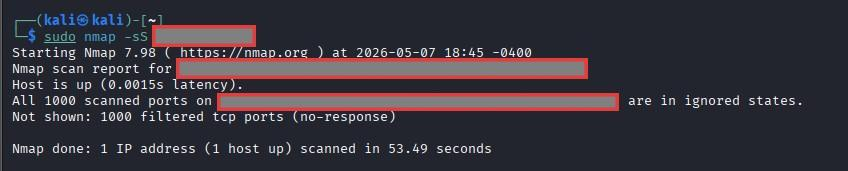

All 1,000 ports came back filtered, confirming UFW is correctly dropping unsolicited packets at the firewall. So even though the site is live and reachable through the domain, the hardware behind it is invisible to a direct scan. With 80/443 closed at the firewall, the tunnel is the only working path in, which rules out direct-to-IP attacks and most automated bot scans.

---

## Takeaways
* Old hardware still has plenty of life in it. Paired with a lightweight, headless OS, it handled a modern, security-conscious deployment without issue.
* Went in aiming for a “no open ports” architecture, and the Nmap audits back that up: the local network is genuinely invisible to internet-wide port scanners.
* Picked up practical experience with systemd service management, DNS configuration, and running a tunnel daemon in production, the kind of day-to-day DevOps work that doesn't show up in tutorials.
